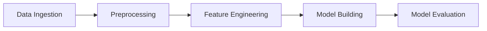

# MLOps Complete ML Pipeline

End-to-end spam SMS classification pipeline with modular Python scripts, DVC automation, parameterised runs, and experiment tracking via DVCLive.

## Pipeline Overview

| Stage | Script | Output |
|-------|--------|--------|
| Data Ingestion | `scr/data_ingestion.py` | `data/raw/` |
| Data Preprocessing | `scr/data_preprocessing.py` | `data/interim/` |
| Feature Engineering | `scr/feature_engineering.py` | `data/processed/` |
| Model Building | `scr/model_building.py` | `models/model.pkl` |
| Model Evaluation | `scr/model_evaluation.py` | `reports/metrics.json`, `dvclive/` |



## Project Structure

```
Mlops_Complete_ML_Pipeline/
├── scr/                  # Pipeline scripts
├── expirements/          # Jupyter notebook & local experiments
├── data/                 # DVC-tracked datasets
├── models/               # Trained model artifacts
├── reports/              # Evaluation metrics
├── dvclive/              # Experiment logs & plots
├── logs/                 # Script logs
├── params.yaml           # Pipeline hyperparameters
├── dvc.yaml              # DVC pipeline definition
├── dvc.lock              # Reproducible stage lock file
└── requirements.txt
```

## Setup

From the repository root:

```bash
# Install dependencies (recommended)
cd ..
uv sync

# Or install from requirements.txt
pip install -r requirements.txt
```

Download required NLTK data (first run only):

```python
import nltk
nltk.download("stopwords")
nltk.download("punkt")
nltk.download("punkt_tab")
```

## Configuration

Edit `params.yaml` to tune the pipeline:

```yaml
data_ingestion:
  test_size: 0.3
feature_engineering:
  max_features: 50
model_building:
  n_estimators: 25
  random_state: 2
```

For AWS S3 remote storage, create a `.env` file (not committed to Git):

```
AWS_ACCESS_KEY_ID=your_key
AWS_SECRET_ACCESS_KEY=your_secret
```

Set the correct bucket region in `.dvc/config` (this project uses `ap-southeast-2`).

## Running the Pipeline

### Run individual stages

```bash
python scr/data_ingestion.py
python scr/data_preprocessing.py
python scr/feature_engineering.py
python scr/model_building.py
python scr/model_evaluation.py
```

### Run the full DVC pipeline

```bash
dvc repro
```

### View the pipeline DAG

```bash
dvc dag
```

### Push artifacts to S3 remote

```bash
dvc push -r dvcstore
```

### Run & compare experiments

```bash
dvc exp run
dvc exp show
```

## Tech Stack

- **ML:** scikit-learn, NLTK, XGBoost
- **Pipeline:** DVC
- **Experiment tracking:** DVCLive
- **Remote storage:** AWS S3

## Notes

- Scripts live in `scr/` (referenced in `dvc.yaml`).
- Large artifacts (`data/`, `models/`, `reports/`) are excluded from Git and managed by DVC.
- Never commit `.env` or AWS credentials.
